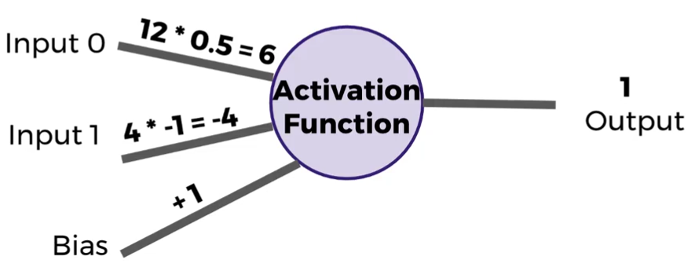
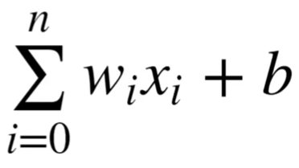
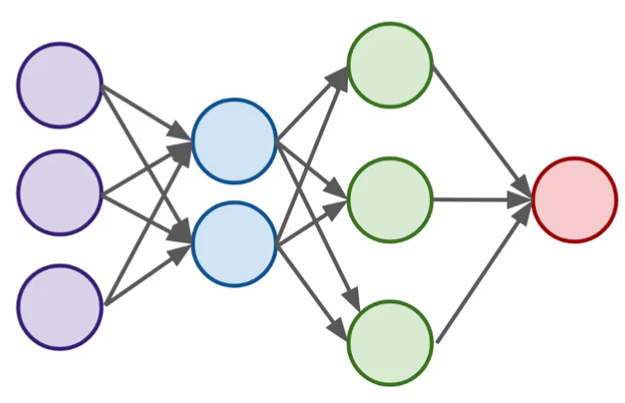

# Introdução

Redes Neurais (RN) em geral trabalham com uma unidade chamada perceptron. Essa unidade tenta ser semelhante ao neurônio humano, por isso o nome de RN.

Ele é representado da seguinte forma:

Com:
* Inputs: as entradas do neuronio
* Pesos: multiplicadores dos inputs
* BIAS: evitar que a entrada tenha um valor que anule o neuronio (zero, por exemplo)
* Output: a saída do neuronio após a função de ativação

Uma equação que representa a matématica é a seguinte:

## Camadas

Uma rede neural tem ao menos duas camadas: entrada e saída. Pode ter camadas ocultas entres as duas principais. Quanto mais camadas ocultas, maior a abstração

A rede acima tem a camada de entrada, duas camadas ocultas e uma camada de saída

## Função de ativação
A função que determina a saída do perceptron. Existem muitas opções:
* linear
    * saída = entrada.pesos + bias
    * muito binário
    * não considera valores intermediários
    * não reflete pequenas alterações
* função sigmóide:
    * também de 0 a 1, porém com uma curvatura mais suave
* Tangente hiperbólica:
    * mesma curvatura da sigmóide, porém de -1 a 1
* ReLu:
    * relativamente simples
    * max(0, saída)

## Função de custo    
Correlação entre a saída da RN e o valor esperado, ou seja, o erro. A função de custo representa a importância do erro no processo de aprendizado.
Existem várias opções, como:
* erro quadrático
    * aprendizado mais lento
    * erro tem peso quadrático
* Cross Entropy
    * aprendizado mais rápido
    * quanto maior a diferença, mais rápido o aprendizado

## Gradiente descendete
Método de otimização de uma RN: busca pelo mínimo de uma função. Tomamos passos que são proporcionais ao gradiente negativo do ponto em questão.
Tenta-se encontrar o melhor valor para os pesos do perceptron.

##Backpropagation
 Usado para calcular a contribuição do erro em cada perceptron depois que um conjunto de dados foi processado.
 Baseado na regra da cadeia do cálculo, ele calcula os valor dos pesos para otimizar a RN e encontrar o mínimo local.
 Calcula o erro e usa esse valor para ajustar os pesos da RN, o que é possível pois uma RN é de aprendizado supervisionado.
 
 
 ## Conceitos de TensorFlow
 ### Placeholder
 Um nó "vazio" que precisa de um valor fornecido para calcular uma saída
 ### Variables
 Parâmetro variável de um grafo. Podemos associar com os pesos da RN.
 ### Graph
 Variável global conectando as variáveis com os placeholders para realizar operações 