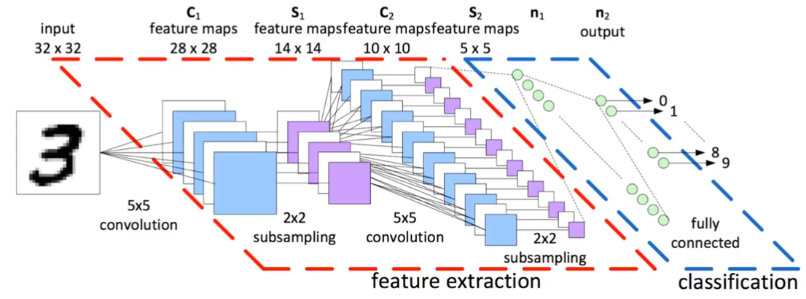
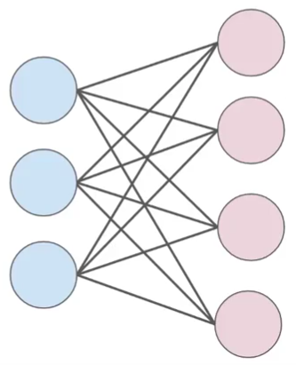
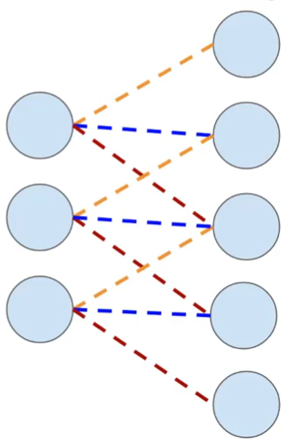

# Redes Neurais Convolucionais (CNN)

### História
Baseado na estrutura de visão de mamíferos (Hubel e Wiesel, Nobel 1981)
* cada neuronio está olhando para uma pequena porção da img total sendo obervada
* Criada pela primeira vez por Yann LeCun (1998)
* esquema

### tensor
* Arrays N-Dimensionais
* Úteis para img pois podemos ter um tensor (I,H, W, C)
    * I - img
    * H: altura (height) em px
    * W: profundidade (widht) em px
    * C: canais de cor (1- cinza, 3-RGB)
    
### Densely Connected NN (DNN) VS CNN
* DNN
    * todos neuronios da camada anterior estão ligados a todos da próx camada
    
* CNN
    * os neuronios da camada anterior estão ligados a alguns da próxima camada
    
    
### Subsampling
* reduz a entrada em amostras
* reduz a memória, carga computacional e params para se observar

