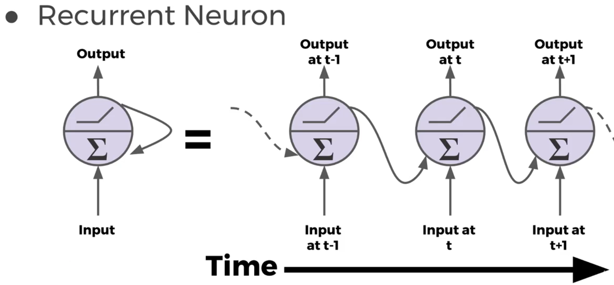
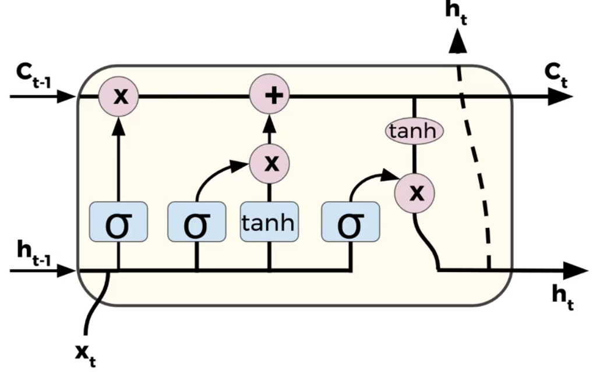

# Recurrent NN

Boa para lidar com sequências de informações: 
* Time Series (vendas), 
* sentenças, 
* audio/música, 
* trajetória de carros etc.

De posse de uma seq, podemos prever os próx pontos se avançarmos algumas unidades de tempo?

Desenho de um neurônio típico da RNN e de sua rede

### Vanishing Gradientes
* Qto > o número de camadas, menos as camadas inicais serão afetadas pelo erro das camadas finais
    * Inicialização e normalização podem contornar boa parte do problema
    * Acontece por causa das função de ativação (como a sigmoide e a tanh) que colocam as saídas entre 0 e 1, fazendo com que cada vez menores num sejam multiplicados pelos erros, o que gera menores numeros sendo enviados para as camadas de trás
* Uma maneira de se evitar
    * usar uma func de ativ como a ReLu, ou uma de suas versões (leaky ou logistic) pode ajudar
        * não penaliza num >0
    * existem algoritmos para ajudar a contornar o problema
        * LSTM
        * GRU
        
### LSTM (long short-term memory)
* LSTM
    * evitar que a RNN tenha "perda de memória" com 't' mto gde

### Word2Vec (W2V)
Transformar um conjunto de palavras em um vetor, p.e.:
* "Ola, como vc vai" => ['ola', 'como', 'vc', 'vai']

Pode ser feito usando TensorFlow, embora não seja recomendado
* existem boas API's que fazem o trabalho pesado que teremos que fazer nós msm usando TF
    * https://radimrehurek.com/gensim/

Abordagens comuns de NLP apenas contam a frequência de ocorrência da palavra em um texto, mas perde o significado e a relação entre palavras
* Gato e Cachorro receberão um num que os id, porém o NLP comum não saberia dizer que ambos possuem relações (ambos são animais, pet, quatro patas etc)

W2V cria um espaço multivetorial em que cada palavra é um vetor e, assim, podemos fazer operações matemáticas entre os vetores
* O espaço é criado aleatoriamente no começo, porém, com uso de backpropagation,vamos ajsutando o valor no espaço de acordo com as dimensões passadas
* Mais dimensões = maior tempo de treino & mais "informação por palavra"
* Modelo pode criar eixos que representam conceitos (verbos, gêneros, singular VS plural etc) 

