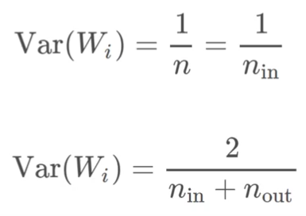
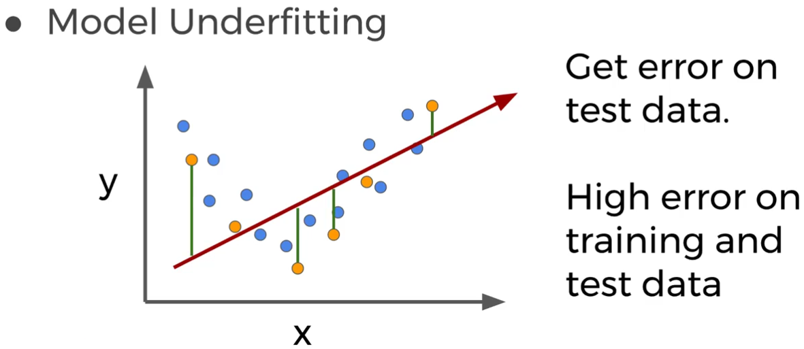
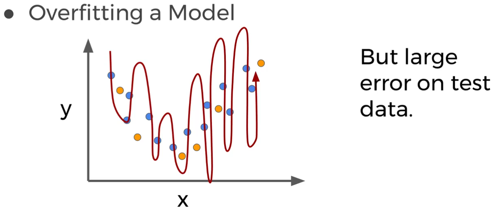
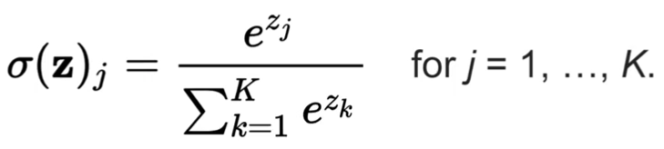

# TensorFlow

Curso de TensorFlow da Perian Data (Udemy)

Tópicos:
* Introdução a redes neurais
* Báciso de TensorFlow
* Redes Neurais Convolucionais
* Redes Neurais Recorrentes
* Tópicos Diversos
* AutoEncoders
* Aprendizado reforçado com OpenAI Gym
* GAN

# Alguma teoria

### Escolha de erros
* Tentativa de ser o mais imparcial o possível
    * zero é uma má escolha
    * dist normal em torno de zero tbm n é ótima
* alternativa:
    * Xavier (Glorot)
    
 
### Taxa de aprendizagem:
* escolha depende do projeto
    * muito baixa: muito tempo para treinar
    * muito alta: pode não convergir
    
### Batch Size: tamanho da porção de entrada dos dados
* Datasets mto gdes podem não ser convenientes de se alimentar de uma única vez
    * peq: menor representatividade nos dados
    * gde: maior tempo de treino
    
### Gradiente descentende
* comportamento de 2 ordem
    * Basicamente a velocidade e que converge o erro
    * permite ajustar a tx de aprendizado com base na tx de caimento do erro
    * tentar proporcinoar um caimento maior no início e mais lento no final
        * AdaGrad
        * RMSProp
        * Adam
        
### Gradientes instáveis/desaparecem
* Qto > o número de camadas, menos as camadas inicais serão afetadas pelo erro das camadas finais
    * Inicialização e normalização podem contornar boa parte do problema
    
### Overfitting e underfitting
* underfitting

* overfitting

* contornos:
* Regularização L1/L2
    * Adiciona penalidade para pesos gds
* Dropout
    * eliminição aleatória de neuronios no treinamento
        * garante que o treino não vai dependender em excesso de um neuronio
* Expansão de dados:
    * artificialmente add ruído, ruído branco em sons etc
    
    
### Regressão Softmax
* Retorna uma lista de propabilidades (entre 0 e 1) que somadas resultam em 1.
* escolhemos a maior probabilidade como a resposta certa
* dificilmente teremos 100% de certeza
* pode ser usada como função de ativação

 
    
    
OBS: Todas imagens são do curso de TensorFlow da Perian Data da Udemy